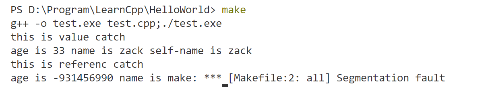

# 动态数组、lambda、function

## C++动态数组

1. C++中提供了两种方式来进行动态内存分配：
   * `new` 运算符：在类型后面使用一个 `[]` 来表示要动态开辟数组类型，其中 `[]` 里面的内容表示要开辟的空间大小，比如 `new int[10]`，分配并初始化一个对象数组，返回值是指向该数组元素的指针，如果要清楚该空间，对应的要使用 `delete[]` 运算符。也可以直接使用数组别名来开辟空间，此时将不再需要 `[]` 。**虽然叫动态数组，但我们得到的并不是一个数组类型，而是指向数组第一个元素的指针，所以没有 `begin` `end`等操作。** 
   * `allocator` ：允许我们将分配和初始化分开。我们可以开辟一块空间，而不进行初始化，等到需要使用的时候再进行初始化。

### allocator类

1. `allocator` 也是一个模板，我们需要显式实例化，它将根据指定的类型来确定恰当的内存大小和对齐位置。
2. 使用  `allocator.allocate()` 成员函数来分配空间，但此时得到的空间并没有进行初始化，我们需要手动调用 `construct` 成员函数来构造对象，最后通过 `deallocate` 成员函数来释放空间。 

## lambda表达式

1. 基础语法：
   ```cpp
   [capture list](parameter){function body;};
   ```

2. 使用方式：

   * 匿名调用：
     ```cpp
     [](string name){
     	cout << name << endl;
     }(string("zyl"));
     ```

   * 使用 `auto` :
     ```cpp
     auto fname = [](string name){
     	cout << name << endl;
     };
     fname("zyl");
     ```

   * 使用函数指针：
     ```cpp
     typedef void (*funptr)(string name);
     funptr f = [](string name){
     	cout << name << endl;
     };
     f("zyl");
     (*f)("zyl");
     ```

   * 使用 `function` 对象：
     ```cpp
     function<void(string)> f;
     f = [](string name){
         cout << name << endl;
     };
     f("zyl");
     ```

3. lambda 表达式的捕获：

   * 值捕获：进行捕获的时候，是使用 `const` 的方式进行捕获的，所以不能在函数体内部修改变量的值。
     ```cpp
     int age = 33;
     string name = "zyl";
     //值捕获
     [age, name](string name_)
     {	
         age++; //error
         cout << "age is " << age << " name is " << name << " self-name is " << name_ << endl;
     }("haha");
     ```

   * 引用捕获：可以修改变量的值。

4. **闭包**：是一个函数，该函数可以**记住并访问其词法作用域中的变量**，即使这个函数在词法作用域之外执行。词法作用域指的是函数在定义的时候确定的变量作用范围，而不是由调用时候决定。
   C++中的lambda表达式虽然以引用的方式捕获了变量，但是并不会延长变量的声明周期，无法达到闭包的效果。

   ```cpp
   vector<function<void(string)>> vec_Funcs;
   void use_lambda2()
   {
       int age = 33;
       string name = "zack";
       vec_Funcs.push_back([age, name](string name_)
                           {   cout << "this is value catch " << endl;
                               cout << "age is " << age << " name is " << name << " self-name is " << name_ << endl; });
       //危险，不要捕获局部变量的引用
       vec_Funcs.push_back([&age, &name](string name_)
                           {   cout << "this is referenc catch" << endl;
                               cout << "age is " << age << " name is " << name << " self-name is " << name_ << endl; });
   }
   
   void use_lambda3()
   {
       for (auto f : vec_Funcs)
       {
           f("zack");
       }
   }
   
   int main(){
       use_lambda2();
       use_lambda3(); //此时age, name 已经释放
   }
   ```

   use_lambda2中将lambda表达式存储在function类型的vector里，当use_lambda2结束后，里边的局部变量都被释放了，而vector中的lambda表达式还存储着局部变量的引用，在调用use_lambda3时调用lambda表达式，此时访问局部变量已经被释放了，所以导致程序崩溃。
   

5. 全部用值捕获，只有 `name` 用引用捕获：
   ```cpp
   [=, &name](){};
   ```

   全部用引用捕获，只有 `name` 用值捕获：
   ```cpp
   [&, name](){};
   ```

## function对象

1. 我们可以使用 `function` 来存储一类形参和返回值都相同的函数指针、lambda表达式、可调用对象等

## bind 操作

1. 将原函数的几个参数通过 `bind` 绑定传值，返回一个新的可调用对象。
   ```cpp
   void globalFun2(string name, int age, int number, string carrer){
       cout << name << " is " << age << " years old,number is " <<
           number << ", carrer is " << carrer << endl;
   }
   
   int main(){
       //绑定全局函数
       auto newfun1 = bind(globalFun2, placeholders::_1, placeholders::_2, 98, "worker");
   
       auto newfun2 = bind(globalFun2, "zack", placeholders::_1, 100, placeholders::_2);
   
       auto newfun3 = bind(globalFun2, "zack", placeholders::_2, 100, placeholders::_1);
       //相当于调用globalFun2("Lily",22, 98,"worker");
       newfun1("Lily", 22);
   
       //多传参数没有用，相当于调用globalFun2("Lucy",28, 98,"worker");
       newfun1("Lucy", 28, 100, "doctor", 10, "hahha");
       
       //相当于调用globalFun2("zack",33,100,"engineer");
       newfun2(33, "engineer");
       
       newfun3("coder", 33);
   }
   ```

   `placeholders` 表示占位符，`_1` 表示新生成函数的第一个参数，依次类推。  

2. 如果绑定类的静态成员函数，与绑定全局函数同理。

3. 如果绑定类的成员函数，要注意 `this` 指针，所以 `bind` 函数的第一个参数是要绑定的成员函数的地址，第二个参数必须是对象或者对象的指针。

4. `bind` 还可以绑定类的成员变量，此时第一个参数必须进行取地址。（绑定函数的时候取地址符可有可无是因为函数名称本来就表示的是这个函数的地址。）