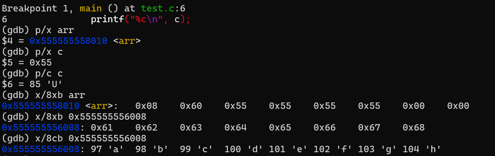
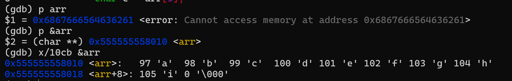

# 数组不是指针

​	很多人有一种错觉：“C语言中，数组就是指针”，但是既然有 **数组和指针** 这两种类型，按照存在即合理的说法，两者肯定有所不同。多数人有上述误解只是因为在某些上下文环境中，两者确实可以进行替换。这篇文章将首先从理论上进行说明，并辅以例子进行作证，最后提出在什么情况下两者可以进行替换。

## 数组和指针是如何访问的

1. 左值、右值：
   ```c
   x = y;
   ```

   对于一个标识符，编译器根据其所在的上下文环境来决定该标识符表示的是一个 **地址** ，还是该 **地址处的内容**。在上面的例子中，显然 `x` 标识符表示的是一个地址，`y` 表示的是该地址处的内容。

   我们将 `x` 称为 **左值** ，其在 **编译期** 可知；而 `y` 称为 **右值**，其在 **运行期** 可知。可以简单理解为左值表示一个地址，而右值表示一个内容 ，也可以根据出现在 `=` 的位置处进行区分。

   ``` c
   int arr[5];
   ```

   而对于上面的 `arr` 而言，显然是一个左值，但是 C语言 规定，这个左值不能进行修改，即数组名是一个不能修改的地址。

2. 数组内容访问：
   ```c
   char arr[9] = "abcdefgh";
   char c = arr[3];
   ```

   编译器中有 `arr` 的地址，比如9980，所以运行时 ：

   *  取出 9980，将他加上 `3` (会乘以具体类型所占的字节大小)
   *  取出修改后的地址的内容

3. 指针访问：
   ```c
   char *p;
   char c = *p;
   ```

   编译器中有 `p` 的地址，比如4624，所以运行时：

   * 取出 4624的内容，是 5081
   * 取出5081的内容

## 数组不是指针实例

1. 将一个变量定义为指针，然后在另一个文件中以数组方式进行声明：
   ```c
   //pointer.c
   char *p = "abcdefg";
   //array.c
   extern char p[];
   char c = p[i];
   ```

   编译器中有 `p` 的地址，比如地址为4064, 因为代码告诉编译器 `p` 是一个数组，所以运行时：

   * 将 4064 + i
   * 取出 4064 + i 的内容

   可是实际上 4064 是指针 `p` 的存储地址，要访问这个具体的字符，要先取出 4064 处的存储内容，加上 i 以后再取字符，使用 `gdb` 来进行验证：
   

   使用 `gdb` 调试的过程中可以看到，编译器认为 `arr` 是一个数组首地址，然后直接将 `arr` 后面的开始的第四个字节内容即 `0x55` 赋值给变量 `c` ，所以 `c` 的内容是 `U` 。
   正确行为应该是将 `arr` 当作一个指针，我们发现取出这个指针的内容，即上面的 `0x555555556008` ，然后再去加上相应的 i 值，才可以在正确的访问到字符。

2. 将一个变量定义为数组，然后在另一个文件中以指针方式进行声明：
   ```c
   //array.c
   char arr[8] = "abcdefg";
   //pointer.c
   extern char* arr;
   char c = arr[i]; 
   ```

   首先要注意的是在 `C` 语言中，下标运算符与间接访问运算符是等价的，即
   ``` c
   char c = arr[i];
   char c = i[arr];
   char c = *(arr + i);
   ```

   编译器中有 `arr` 的地址，比如4624，因为你告诉编译器 `arr` 是一个指针，所以运行时：

   * 取出 4624的内容，是 5081
   * 将 5081 + i 
   * 取出 5081 + i 的内容

   程序运行时肯定会出现 `segmentation fault` ，使用 `gdb` 调试如下：
   

   `arr` 是一个数组首地址，但是因为告诉编译器它是一个指针，所以会将 `arr` 开始的八个字节的内容当作一个地址去进行访问，而这个地址大概率都是违法的，所以出现 `segmentation fault` 。

## 数组是指针的时候

1. 参考下图：
   